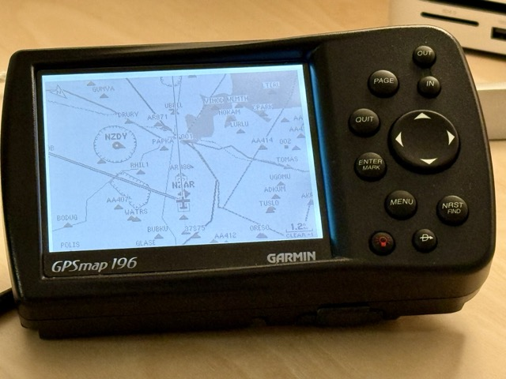

# GPS‑Map × X‑Plane 12 API Connector



A lightweight Python bridge that streams live flight data from **X‑Plane 12’s Web API** to a real **Garmin GPS‑map 196** (or any receiver that understands Garmin *Aviation‑In* sentences).

Built by and for cockpit‑builders and sim‑enthusiasts.

---

## ✈️ What it does

```
X‑Plane 12  ─┬─> WebSocket (JSON frames) ──┐
            │                             │
            │   garmin_gps_webapi.py      ▼
            └─> Garmin‑ready events  ──> garmin_gps_connector.py
                                          │
                                          └─> Serial / USB‑TTL
                                               (4800–9600 baud)
```

* Subscribes to key datarefs (lat, lon, elevation, mag heading, mag variation, airspeed, pause flag).  
* Converts each update to a single **Aviation‑In** ASCII sentence.  
* Auto‑detects simulator **pause / resume** and sets airspeed = 0.  
* Robust‑retry loop → you can launch the connector **before** or **after** X‑Plane, and it will reconnect automatically (5 s → 10 s back‑off).  
* **Test mode** prints sentences to stdout—perfect for development with no hardware.

---

## 📦 Features

| Feature | Status |
|---------|--------|
| Web‑API numeric ID lookup | ✅ |
| Async WebSocket client (`asyncio` / `websockets`) | ✅ |
| Synthetic pause detection (`PauseState`) | ✅ |
| Auto‑retry on disconnect (max 10 s back‑off) | ✅ |
| Mock serial port for `--test` | ✅ |
| Typed event dataclasses for clean matching | ✅ |
| Extensive logging to console | ✅ |

---

## 🖥️ Prerequisites

* **Python 3.9+**  
  `pip install -r requirements.txt`  
  (Main deps: `websockets`, `pyserial`, `PyYAML`)
* **X‑Plane 12** with Web API enabled  
  *Settings → Network → “Accept Incoming Connections”*  
  Default endpoint is `ws://localhost:8086/ws`.

---

## ⚙️ Configuration (`resources/config.yml`)

```yaml
x-plane:
  connection:
    serial:
      device   : /dev/ttyUSB0   # or COM3 on Windows, /dev/tty.usbserial‑xxx on macOS
      baud     : 9600
      timeout  : 5
    webapi:
      url            : "http://localhost:8086/api/v2"
      message_rate   : 10    # emit every N frames
      pause_timeout  : 1.5   # silence → paused
```

---

## 🚀 Running

```bash
# Real hardware
python src/garmin_gps_connector.py

# Test mode (no serial port required)
python src/garmin_gps_connector.py --test
```

You can start/stop X‑Plane at any time; the connector will reconnect automatically.

---

## 🛠️ Hardware notes

* Garmin GPS‑map 196 expects **NMEA‑0183 / Aviation‑In** at 4800‑9600 baud (8‑N‑1).  
* Use a USB‑TTL adapter + level shifter if your GPS needs RS‑232 levels.  

---

## 🤝 Contributing

* Fork → feature branch → PR.  
* Please lint your code before submitting.
---

## 📄 License

*Code*: CC BY-NC 4.0 – non-commercial use only.  
For commercial licensing, contact <you@example.com>.